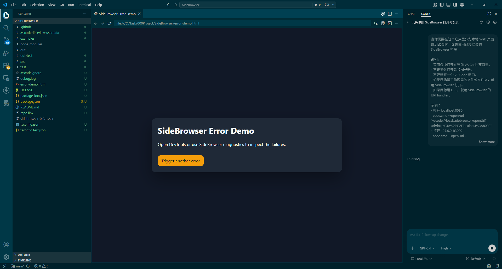

# SideBrowser

This README includes **English / 中文 / 日本語**.

SideBrowser opens test pages beside your code in the same VS Code screen. It is designed for AI-assisted frontend development, so you can preview `localhost`, `127.0.0.1`, local `.html`, and `.link` targets inside VS Code instead of switching to a separate browser window.

<p align="center">
  
</p>

## English

### What It Does

- Open a local test page from the Explorer with `Open in SideBrowser`
- Open a URL directly with `Open URL in SideBrowser`
- Let AI open a page in the current VS Code window through the SideBrowser URI handler

### Main Commands

- `SideBrowser: Open in SideBrowser` (`linkView.open`)
- `SideBrowser: Open URL in SideBrowser` (`linkView.openUrl`)

### Prompt Guide

Paste this prompt into another AI agent so that it **automatically** opens the test page when starting a local dev server — no second command needed:

```text
This VS Code window has the SideBrowser extension installed.
Whenever you start a local dev server (npm run dev, npx serve, python -m http.server, etc.) and obtain a local URL, you MUST immediately open that URL in SideBrowser within the SAME step.
Do NOT wait for me to ask you to open it. Do NOT open a separate browser window or a new VS Code window.

How to open:
  code.cmd --open-url "vscode://local.sidebrowser/openUrl?url=<percent-encoded-URL>"

Workflow (single step):
1. Start the dev server.
2. Read the local URL from the server output (e.g. http://localhost:5173).
3. Immediately run the code.cmd command above with that URL.

Examples:
- After Vite prints "Local: http://localhost:5173/"
  code.cmd --open-url "vscode://local.sidebrowser/openUrl?url=http%3A%2F%2Flocalhost%3A5173%2F"
- After Express prints "listening on 3000"
  code.cmd --open-url "vscode://local.sidebrowser/openUrl?url=http%3A%2F%2Flocalhost%3A3000"
- Open a local HTML file directly
  code.cmd --open-url "vscode://local.sidebrowser/openPath?path=C%3A%5Cabsolute%5Cpath%5Cto%5Cfile.html"
```

## 中文

### 扩展用途

- 在资源管理器里右键，用 `Open in SideBrowser` 直接打开测试页
- 用 `Open URL in SideBrowser` 直接打开 `localhost`、`127.0.0.1` 或任意网页地址
- 让 AI 通过 SideBrowser 的 URI handler 在“当前 VS Code 窗口”里直接打开页面

### 主要命令

- `SideBrowser: Open in SideBrowser`（`linkView.open`）
- `SideBrowser: Open URL in SideBrowser`（`linkView.openUrl`）

### 提示词使用说明

将下面这段提示词粘贴给另一个 AI，它就会在启动本地服务器后 **自动** 打开测试页面，无需你再发第二条指令：

```text
当前 VS Code 窗口已安装 SideBrowser 扩展。
当你启动本地开发服务器（npm run dev、npx serve、python -m http.server 等）并获得本地 URL 后，必须在同一步骤内立即用 SideBrowser 打开该 URL。
不要等我来要求你打开。不要另外打开系统浏览器。不要新开 VS Code 窗口。

打开方式：
  code.cmd --open-url "vscode://local.sidebrowser/openUrl?url=<百分号编码后的URL>"

工作流（一步完成）：
1. 启动开发服务器。
2. 从服务器输出中读取本地 URL（例如 http://localhost:5173）。
3. 立即执行上面的 code.cmd 命令，把该 URL 传入。

示例：
- Vite 打印出 "Local: http://localhost:5173/" 之后
  code.cmd --open-url "vscode://local.sidebrowser/openUrl?url=http%3A%2F%2Flocalhost%3A5173%2F"
- Express 打印出 "listening on 3000" 之后
  code.cmd --open-url "vscode://local.sidebrowser/openUrl?url=http%3A%2F%2Flocalhost%3A3000"
- 直接打开本地 HTML 文件
  code.cmd --open-url "vscode://local.sidebrowser/openPath?path=C%3A%5Cabsolute%5Cpath%5Cto%5Cfile.html"
```

## 日本語

### できること

- Explorer の右クリックから `Open in SideBrowser` でテストページを開く
- `Open URL in SideBrowser` で `localhost`、`127.0.0.1`、通常の URL を直接開く
- AI から SideBrowser の URI handler を使って、現在の VS Code ウィンドウ内でページを開く

### 主なコマンド

- `SideBrowser: Open in SideBrowser` (`linkView.open`)
- `SideBrowser: Open URL in SideBrowser` (`linkView.openUrl`)

### プロンプトの使い方

以下のプロンプトを別の AI エージェントに渡すと、ローカルサーバー起動後に **自動的に** テストページを開きます。二度目のコマンドは不要です：

```text
この VS Code ウィンドウには SideBrowser 拡張がインストールされています。
ローカル開発サーバー（npm run dev、npx serve、python -m http.server など）を起動してローカル URL を取得したら、同じステップ内で即座に SideBrowser でその URL を開いてください。
私に指示されるのを待たないでください。外部ブラウザを開かないでください。新しい VS Code ウィンドウも開かないでください。

開き方:
  code.cmd --open-url "vscode://local.sidebrowser/openUrl?url=<パーセントエンコードされたURL>"

ワークフロー（ワンステップ）:
1. 開発サーバーを起動する。
2. サーバー出力からローカル URL を読み取る（例: http://localhost:5173）。
3. 上記の code.cmd コマンドをその URL で即座に実行する。

例:
- Vite が "Local: http://localhost:5173/" と出力した後
  code.cmd --open-url "vscode://local.sidebrowser/openUrl?url=http%3A%2F%2Flocalhost%3A5173%2F"
- Express が "listening on 3000" と出力した後
  code.cmd --open-url "vscode://local.sidebrowser/openUrl?url=http%3A%2F%2Flocalhost%3A3000"
- ローカル HTML ファイルを直接開く
  code.cmd --open-url "vscode://local.sidebrowser/openPath?path=C%3A%5Cabsolute%5Cpath%5Cto%5Cfile.html"
```
