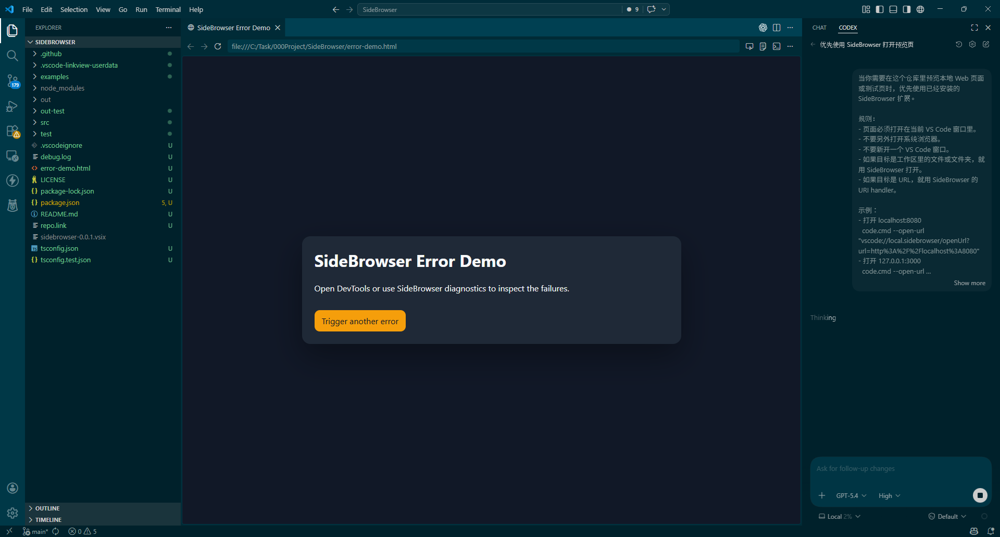

# SideBrowser

<p align="center">
  
</p>

<p align="center">
  <strong>Fully open source.</strong> The publisher account is not yet verified on the VS Code Marketplace — every line of code is auditable in the public repository below.<br />
  Source: <a href="https://github.com/myerwang/SideBrowser">github.com/myerwang/SideBrowser</a> · License: <a href="./LICENSE">MIT</a>
</p>

**English** | [中文](#中文) | [日本語](#日本語)

---

## English

> Open test pages beside your code — in the same VS Code window.

SideBrowser is a VS Code extension built for **AI-assisted frontend development**. It previews `localhost`, `127.0.0.1`, local `.html` files, and `.link` targets inside a side panel — no window switching needed.

**Quick start:** Right-click any supported file or folder in the Explorer → **Open in SideBrowser**. Or open the Command Palette (`Ctrl+Shift+P` / `Cmd+Shift+P`) and search `SideBrowser`.

### AI Prompt — Make It Permanent

Paste the rule below **once** into any AI assistant chat in this workspace. The prompt is harness-agnostic: the AI will detect its own runtime (Copilot, Cline, Cursor, Windsurf, Continue, Codex, Claude Code, Gemini, etc.) and persist the rule to its own rules / system-instruction location automatically.

```text
SideBrowser — Auto-open Rule

This VS Code window has the SideBrowser extension installed.

1. Persist this rule
   Save this instruction to whatever location your AI tooling uses for persistent
   project or system rules so it survives across sessions.

2. Apply this rule
   Whenever you start a local dev server (npm run dev, npx serve, python -m
   http.server, etc.) and obtain a local URL, open that URL in SideBrowser within
   the SAME step. Do NOT wait to be asked. Do NOT open an external browser or a
   new VS Code window.

How to open:
  macOS / Linux:   code     --open-url "vscode://YohjiUbun.sidebrowser/openUrl?url=<URL-encoded URL>"
  Windows:         code.cmd --open-url "vscode://YohjiUbun.sidebrowser/openUrl?url=<URL-encoded URL>"

Open a local file directly:
                   --open-url "vscode://YohjiUbun.sidebrowser/openPath?path=<URL-encoded absolute path>"

Examples:
  Vite      → vscode://YohjiUbun.sidebrowser/openUrl?url=http%3A%2F%2Flocalhost%3A5173%2F
  Express   → vscode://YohjiUbun.sidebrowser/openUrl?url=http%3A%2F%2Flocalhost%3A3000
  HTML file → vscode://YohjiUbun.sidebrowser/openPath?path=%2Fabsolute%2Fpath%2Fto%2Ffile.html
```

> **Tip:** Once persisted, commit the generated rule file to Git so every teammate inherits the same auto-open behavior.

### Supported file types

| Resource | Extensions / notes |
| --- | --- |
| Web URLs | `http://` / `https://` — localhost, 127.0.0.1, remote sites; embedded in webview or VS Code's Simple Browser |
| `.link` files | Single-line text file containing one HTTP(S) URL — used as a bookmark |
| HTML | `.html` `.htm` `.xhtml` `.shtml` |
| Markdown | `.md` `.markdown` `.mdown` `.mkd` — delegates to VS Code's Markdown preview |
| PDF | `.pdf` — opens in VS Code's built-in PDF viewer |
| Images | `.png` `.jpg` `.jpeg` `.gif` `.bmp` `.webp` `.svg` `.ico` `.avif` `.tif` `.tiff` |
| Audio / video | `.mp3` `.wav` `.ogg` `.flac` `.m4a` `.aac` `.mp4` `.webm` `.ogv` `.mov` |
| Jupyter notebook | `.ipynb` |
| Folders | First match wins: `preview.link` / `index.link` / `default.link` / `home.link`, then `index.html` / `default.html` / `home.html` (and `.htm` variants) |

### Commands

| Command | Description |
| --- | --- |
| `SideBrowser: Open in SideBrowser` | Right-click a file in Explorer to open it in the side panel |
| `SideBrowser: Open URL in SideBrowser` | Open any URL via the command palette |
| `SideBrowser: Refresh SideBrowser` | Reload the current page |
| `SideBrowser: Open in External Browser` | Open the current page in your system browser |
| `SideBrowser: New Link File` | Create a new `.link` file to bookmark a URL |

### URI Handler

External tools (including AI agents) can open pages programmatically:

| Action | URI Pattern |
| --- | --- |
| Open URL | `vscode://YohjiUbun.sidebrowser/openUrl?url=<percent-encoded-URL>` |
| Open local file | `vscode://YohjiUbun.sidebrowser/openPath?path=<percent-encoded-absolute-path>` |

```bash
# macOS / Linux
code --open-url "vscode://YohjiUbun.sidebrowser/openUrl?url=http%3A%2F%2Flocalhost%3A5173%2F"

# Windows
code.cmd --open-url "vscode://YohjiUbun.sidebrowser/openUrl?url=http%3A%2F%2Flocalhost%3A5173%2F"
```

### Configuration

| Setting | Type | Default | Description |
| --- | --- | --- | --- |
| `linkView.previewMode` | `string` | `nativeBrowser` | In-editor preview surface: `nativeBrowser` or `webview` |
| `linkView.previewFallbackMode` | `string` | `externalBrowser` | Fallback when `nativeBrowser` cannot open the target: `externalBrowser` or `webview` |
| `linkView.externalBrowser.kind` | `string` | `system` | Browser for "Open in External Browser": `system` / `edge` / `chrome` / `firefox` / `safari` / `custom` |
| `linkView.externalBrowser.customPath` | `string` | `""` | Executable path when kind is `custom` |
| `linkView.externalBrowser.customArgs` | `string[]` | `[]` | Extra arguments for the custom browser |

### Troubleshooting

- **Diagnostic logs** — open the **Output** panel (View → Output) and select the **SideBrowser** channel to inspect preview, embedding, and fallback events.
- **URI aliases** — the URI handler also accepts kebab-case `open-url` / `open-path`, equivalent to `openUrl` / `openPath`.
- **Page won't embed** — sites that return `X-Frame-Options` or CSP `frame-ancestors` headers are detected; SideBrowser shows an *Open Externally* button to launch the configured browser instead.

---

## 中文

> 在同一个 VS Code 窗口中，将测试页面打开在代码旁边。

SideBrowser 是一个专为 **AI 辅助前端开发** 设计的 VS Code 扩展。在侧边面板中预览 `localhost`、`127.0.0.1`、本地 `.html` 文件和 `.link` 目标，无需切换窗口。

**快速开始：** 在资源管理器中右键任意受支持的文件或文件夹 → **Open in SideBrowser**。或打开命令面板（`Ctrl+Shift+P` / `Cmd+Shift+P`）搜索 `SideBrowser`。

### AI 提示词 — 一次设置，永久生效

在本工作区的任意 AI 助手对话中，**粘贴一次**下方提示词即可。提示词与 harness 无关：AI 会识别自身运行环境（Copilot、Cline、Cursor、Windsurf、Continue、Codex、Claude Code、Gemini 等）并自动将规则持久化到对应的规则/系统指令位置。

```text
SideBrowser — 自动打开规则

当前 VS Code 窗口已安装 SideBrowser 扩展。

1. 持久化此规则
   将本指令保存到你所在 AI 工具用于持久化项目或系统规则的位置，
   使其在跨会话后仍然生效。

2. 应用此规则
   每当你启动本地开发服务器（npm run dev、npx serve、
   python -m http.server 等）并获得本地 URL 后，必须在同一步骤内
   立即用 SideBrowser 打开该 URL。不要等用户要求。不要打开外部
   浏览器或新的 VS Code 窗口。

打开方式：
  macOS / Linux:   code     --open-url "vscode://YohjiUbun.sidebrowser/openUrl?url=<URL 编码后的 URL>"
  Windows:         code.cmd --open-url "vscode://YohjiUbun.sidebrowser/openUrl?url=<URL 编码后的 URL>"

直接打开本地文件：
                   --open-url "vscode://YohjiUbun.sidebrowser/openPath?path=<URL 编码后的绝对路径>"

示例：
  Vite      → vscode://YohjiUbun.sidebrowser/openUrl?url=http%3A%2F%2Flocalhost%3A5173%2F
  Express   → vscode://YohjiUbun.sidebrowser/openUrl?url=http%3A%2F%2Flocalhost%3A3000
  HTML 文件 → vscode://YohjiUbun.sidebrowser/openPath?path=%2Fabsolute%2Fpath%2Fto%2Ffile.html
```

> **提示：** 持久化后将生成的规则文件提交到 Git，团队成员 clone 后即继承相同的自动打开行为。

### 支持的文件类型

| 资源 | 扩展名 / 说明 |
| --- | --- |
| Web URL | `http://` / `https://` — localhost、127.0.0.1、远程站点；在 webview 中嵌入或使用 VS Code 自带的 Simple Browser |
| `.link` 文件 | 单行文本文件，内容为一个 HTTP(S) URL，用作书签 |
| HTML | `.html` `.htm` `.xhtml` `.shtml` |
| Markdown | `.md` `.markdown` `.mdown` `.mkd` — 委托给 VS Code 自带的 Markdown 预览 |
| PDF | `.pdf` — 在 VS Code 内置 PDF 查看器中打开 |
| 图片 | `.png` `.jpg` `.jpeg` `.gif` `.bmp` `.webp` `.svg` `.ico` `.avif` `.tif` `.tiff` |
| 音频 / 视频 | `.mp3` `.wav` `.ogg` `.flac` `.m4a` `.aac` `.mp4` `.webm` `.ogv` `.mov` |
| Jupyter Notebook | `.ipynb` |
| 文件夹 | 优先取首个命中：`preview.link` / `index.link` / `default.link` / `home.link`，其次 `index.html` / `default.html` / `home.html`（含 `.htm` 变体） |

### 命令

| 命令 | 说明 |
| --- | --- |
| `SideBrowser: Open in SideBrowser` | 在资源管理器中右键文件，在侧边面板打开 |
| `SideBrowser: Open URL in SideBrowser` | 通过命令面板打开任意 URL |
| `SideBrowser: Refresh SideBrowser` | 刷新当前页面 |
| `SideBrowser: Open in External Browser` | 在系统浏览器中打开当前页面 |
| `SideBrowser: New Link File` | 创建 `.link` 文件以收藏 URL |

### URI Handler

外部工具（包括 AI 代理）可以通过编程方式打开页面：

| 操作 | URI 格式 |
| --- | --- |
| 打开 URL | `vscode://YohjiUbun.sidebrowser/openUrl?url=<百分号编码的URL>` |
| 打开本地文件 | `vscode://YohjiUbun.sidebrowser/openPath?path=<百分号编码的绝对路径>` |

```bash
# macOS / Linux
code --open-url "vscode://YohjiUbun.sidebrowser/openUrl?url=http%3A%2F%2Flocalhost%3A5173%2F"

# Windows
code.cmd --open-url "vscode://YohjiUbun.sidebrowser/openUrl?url=http%3A%2F%2Flocalhost%3A5173%2F"
```

### 配置项

| 设置项 | 类型 | 默认值 | 说明 |
| --- | --- | --- | --- |
| `linkView.previewMode` | `string` | `nativeBrowser` | 编辑器内预览方式：`nativeBrowser` 或 `webview` |
| `linkView.previewFallbackMode` | `string` | `externalBrowser` | `nativeBrowser` 无法打开时的回退方式：`externalBrowser` 或 `webview` |
| `linkView.externalBrowser.kind` | `string` | `system` | "在外部浏览器中打开"使用的浏览器：`system` / `edge` / `chrome` / `firefox` / `safari` / `custom` |
| `linkView.externalBrowser.customPath` | `string` | `""` | kind 为 `custom` 时的浏览器可执行文件路径 |
| `linkView.externalBrowser.customArgs` | `string[]` | `[]` | 自定义浏览器的额外启动参数 |

### 故障排查

- **诊断日志** — 打开 **输出** 面板（查看 → 输出），选择 **SideBrowser** 频道，可查看预览、嵌入、回退等事件。
- **URI 别名** — URI handler 同时接受 kebab-case 形式的 `open-url` / `open-path`，与 `openUrl` / `openPath` 等价。
- **页面无法嵌入** — 站点若返回 `X-Frame-Options` 或 CSP `frame-ancestors` 头部会被自动识别，SideBrowser 会显示 *Open Externally* 按钮，改用配置的外部浏览器打开。

---

## 日本語

> コードの隣にテストページを開く — 同じ VS Code ウィンドウ内で。

SideBrowser は **AI アシスト付きフロントエンド開発** 向けの VS Code 拡張機能です。`localhost`、`127.0.0.1`、ローカル `.html` ファイル、`.link` ターゲットをサイドパネルでプレビューでき、ウィンドウの切り替えが不要になります。

**クイックスタート：** エクスプローラーで対応ファイルまたはフォルダを右クリック → **Open in SideBrowser**。あるいはコマンドパレット（`Ctrl+Shift+P` / `Cmd+Shift+P`）で `SideBrowser` を検索。

### AI プロンプト — 一度設定すれば永続的に有効

このワークスペース内の任意の AI アシスタントとのチャットに、下記のプロンプトを **一度だけ** 貼り付けてください。プロンプトは harness 非依存：AI が自身のランタイム（Copilot、Cline、Cursor、Windsurf、Continue、Codex、Claude Code、Gemini など）を識別し、対応するルール／システム指示の保存先へ自動的に永続化します。

```text
SideBrowser — 自動オープンルール

この VS Code ウィンドウには SideBrowser 拡張機能がインストールされています。

1. このルールを永続化する
   AI ツールが永続的なプロジェクト／システムルールを保存している場所に
   本指示を保存し、セッションを跨いでも有効になるようにしてください。

2. このルールを適用する
   ローカル開発サーバー（npm run dev、npx serve、python -m http.server
   など）を起動してローカル URL を取得したら、同じステップ内で即座に
   SideBrowser でその URL を開いてください。ユーザーに指示されるのを
   待たないでください。外部ブラウザや新しい VS Code ウィンドウを
   開かないでください。

開き方：
  macOS / Linux:   code     --open-url "vscode://YohjiUbun.sidebrowser/openUrl?url=<URL エンコード済みの URL>"
  Windows:         code.cmd --open-url "vscode://YohjiUbun.sidebrowser/openUrl?url=<URL エンコード済みの URL>"

ローカルファイルを直接開く：
                   --open-url "vscode://YohjiUbun.sidebrowser/openPath?path=<URL エンコード済みの絶対パス>"

例：
  Vite      → vscode://YohjiUbun.sidebrowser/openUrl?url=http%3A%2F%2Flocalhost%3A5173%2F
  Express   → vscode://YohjiUbun.sidebrowser/openUrl?url=http%3A%2F%2Flocalhost%3A3000
  HTML ファイル → vscode://YohjiUbun.sidebrowser/openPath?path=%2Fabsolute%2Fpath%2Fto%2Ffile.html
```

> **ヒント：** 永続化されたルールファイルを Git にコミットすれば、チームメンバーも clone 後に同じ自動オープン動作を継承できます。

### サポートされるファイルタイプ

| リソース | 拡張子 / 備考 |
| --- | --- |
| Web URL | `http://` / `https://` — localhost、127.0.0.1、リモートサイト。webview に埋め込むか、VS Code 標準の Simple Browser で表示 |
| `.link` ファイル | 1 行に HTTP(S) URL を記述したテキストファイル。ブックマークとして使用 |
| HTML | `.html` `.htm` `.xhtml` `.shtml` |
| Markdown | `.md` `.markdown` `.mdown` `.mkd` — VS Code 標準の Markdown プレビューに委譲 |
| PDF | `.pdf` — VS Code 標準の PDF ビューアで表示 |
| 画像 | `.png` `.jpg` `.jpeg` `.gif` `.bmp` `.webp` `.svg` `.ico` `.avif` `.tif` `.tiff` |
| 音声 / 動画 | `.mp3` `.wav` `.ogg` `.flac` `.m4a` `.aac` `.mp4` `.webm` `.ogv` `.mov` |
| Jupyter Notebook | `.ipynb` |
| フォルダ | 最初に見つかった候補が採用されます：`preview.link` / `index.link` / `default.link` / `home.link`、次に `index.html` / `default.html` / `home.html`（`.htm` 含む） |

### コマンド

| コマンド | 説明 |
| --- | --- |
| `SideBrowser: Open in SideBrowser` | エクスプローラーでファイルを右クリックしてサイドパネルで開く |
| `SideBrowser: Open URL in SideBrowser` | コマンドパレットから任意の URL を開く |
| `SideBrowser: Refresh SideBrowser` | 現在のページをリロード |
| `SideBrowser: Open in External Browser` | 現在のページをシステムブラウザで開く |
| `SideBrowser: New Link File` | URL をブックマークする `.link` ファイルを作成 |

### URI ハンドラー

外部ツール（AI エージェントを含む）がプログラム的にページを開けます：

| 操作 | URI パターン |
| --- | --- |
| URL を開く | `vscode://YohjiUbun.sidebrowser/openUrl?url=<パーセントエンコードされたURL>` |
| ローカルファイルを開く | `vscode://YohjiUbun.sidebrowser/openPath?path=<パーセントエンコードされた絶対パス>` |

```bash
# macOS / Linux
code --open-url "vscode://YohjiUbun.sidebrowser/openUrl?url=http%3A%2F%2Flocalhost%3A5173%2F"

# Windows
code.cmd --open-url "vscode://YohjiUbun.sidebrowser/openUrl?url=http%3A%2F%2Flocalhost%3A5173%2F"
```

### 設定

| 設定項目 | 型 | デフォルト | 説明 |
| --- | --- | --- | --- |
| `linkView.previewMode` | `string` | `nativeBrowser` | エディタ内プレビュー方式：`nativeBrowser` または `webview` |
| `linkView.previewFallbackMode` | `string` | `externalBrowser` | `nativeBrowser` で開けない場合のフォールバック：`externalBrowser` または `webview` |
| `linkView.externalBrowser.kind` | `string` | `system` | 「外部ブラウザで開く」で使用するブラウザ：`system` / `edge` / `chrome` / `firefox` / `safari` / `custom` |
| `linkView.externalBrowser.customPath` | `string` | `""` | kind が `custom` の場合のブラウザ実行ファイルパス |
| `linkView.externalBrowser.customArgs` | `string[]` | `[]` | カスタムブラウザの追加引数 |

### トラブルシューティング

- **診断ログ** — **出力** パネル（表示 → 出力）を開き、**SideBrowser** チャンネルを選択するとプレビュー、埋め込み、フォールバックのイベントを確認できます。
- **URI エイリアス** — URI ハンドラーは kebab-case の `open-url` / `open-path` も受け付け、`openUrl` / `openPath` と等価です。
- **ページが埋め込めない** — `X-Frame-Options` や CSP `frame-ancestors` ヘッダーを返すサイトを検出すると、SideBrowser は *Open Externally* ボタンを表示し、設定済みの外部ブラウザで開きます。

---

## License

[MIT](./LICENSE)
